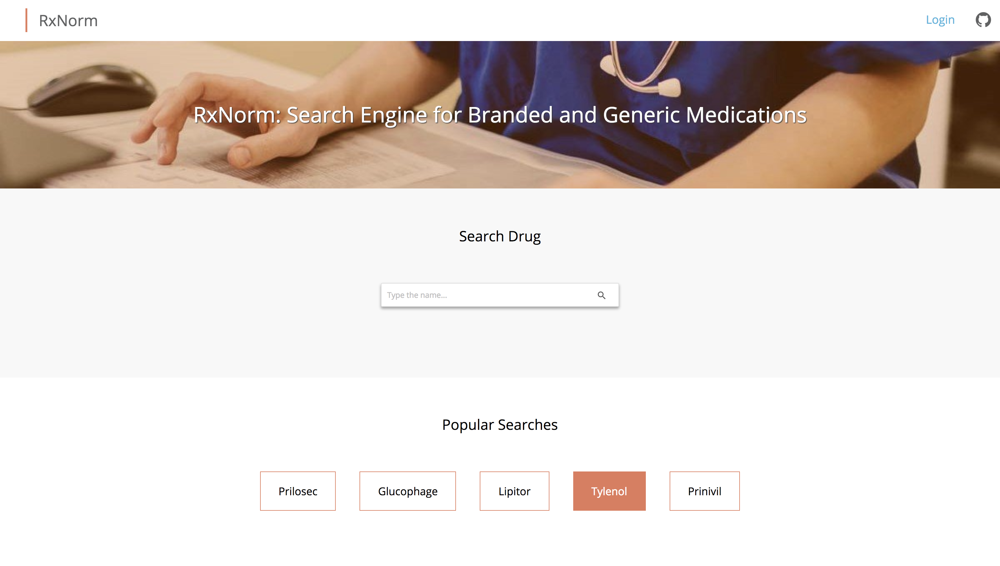
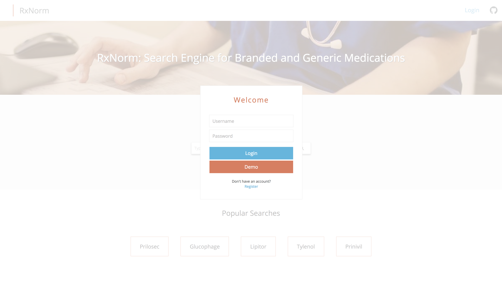
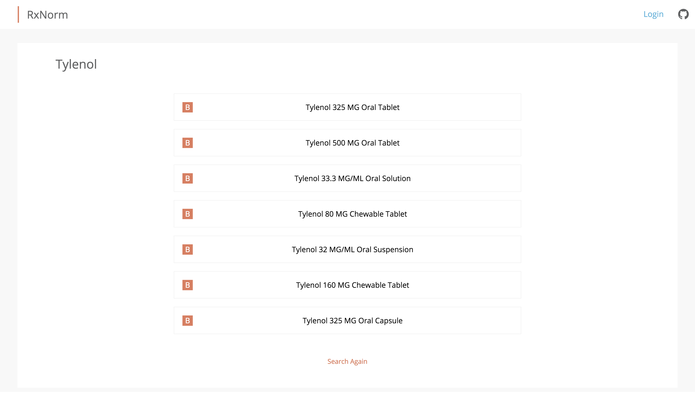

# RxNorm

[RxNorm Live][live]

[live]: https://rxnorm2017.herokuapp.com/#/

## Description

[RxNorm][live] is a full stack web application built using Ruby on Rails, PostgreSQL, React, and Redux. It enables users to find all generic and branded drugs that contain the same active ingredients as a reference drug. A capability like this could, for example, help clinicians provide guidance to patients with price or coverage concerns about the reference drug, or to help work around out-of-stock situations at the local pharmacy.

## Features

### Authentication

Users can securely create accounts using BCrypt. Registration is required to keep track of search history.

### RxNorm API

Utilized RxNorm API to search the drug and find all related generic and branded drugs. Also top 5 popular drugs are ranked based on the number of searches performed by registered users on the backend and are displayed on the main page.